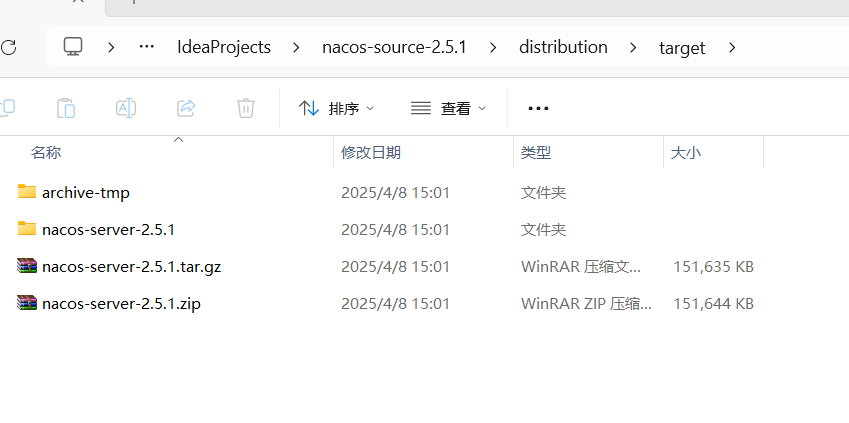
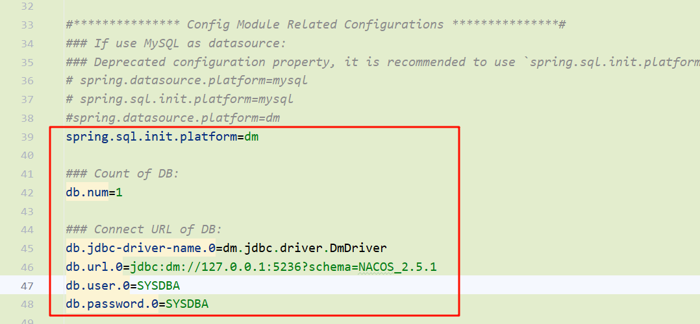
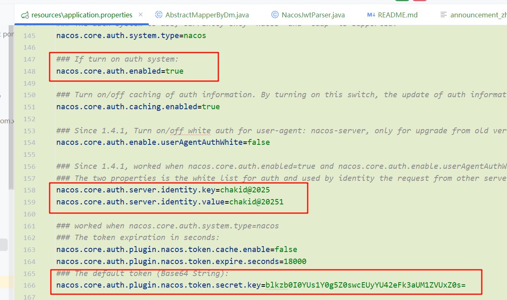
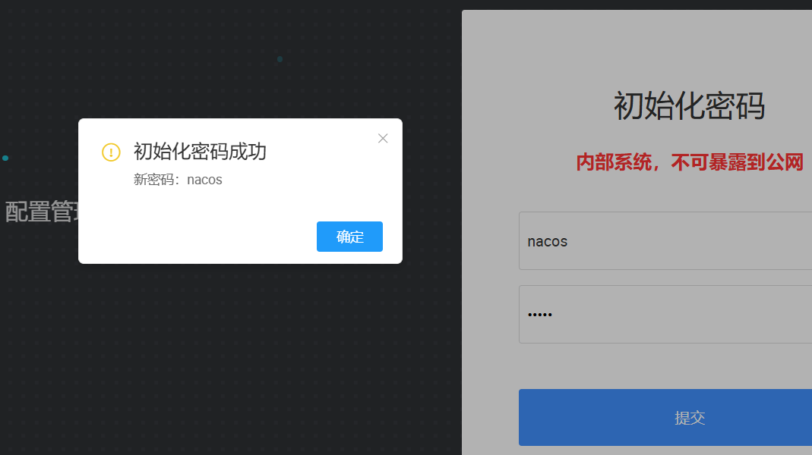

### 基于nacos2.5.1版本修改适配达梦

*参考文章：https://www.cnblogs.com/zhoutuo/p/18442988*

##### 1、初始化sql [NACOS_2.5.1.sql](sql/NACOS_2.5.1.sql)

在达梦数据库新建`NACOS_2.5.1`模式，然后导入上述sql

##### 2、打包命令：

进入下载源码后的根目录执行：

```shell
mvn -Prelease-nacos clean install -Dmaven.test.skip=true -Dcheckstyle.skip=true -Dpmd.skip=true -Drat.skip=true -U
```

打包之后生成目录



##### 注意事项：

启动时，添加单机启动参数

​	win为例：进入`nacos-servcer-2.5.1\nacos\bin` 目录，打开cmd,执行`startup.cmd -m standalone` 单机形式启动

​	配置文件在`nacos-source-2.5.1\distribution\target\nacos-server-2.5.1\nacos\conf` 目录下

⚠️配置注意事项：

​	**数据库配置可参考源代码配置**：`nacos-source-2.5.1\console\src\main\resources\application.properties`这个文件
	


​	**配置鉴权：** `nacos.core.auth.enabled` 开启鉴权

​           `nacos.core.auth.server.identity.key`和`nacos.core.auth.server.identity.value`也需要配置，不然会弹[nvalid server identity key or value, Please make sure set `nacos.core.auth.server.identity.key` and `nacos.core.auth.server.identity.value`, or open `nacos.core.auth.enable.userAgentAuthWhite

详细说明：https://nacos.io/en/blog/faq/nacos-user-question-history14705/

`nacos.core.auth.plugin.nacos.token.secret.key`相当于JWT的密钥，建议生产一个32位的随机字符串然后base64之后配置到该属性



 #### 启动：

首次启动访问：http://127.0.0.1:8848/nacos 登录用户nacos/nacos会自动生成一个密码，该密码为初始密码

